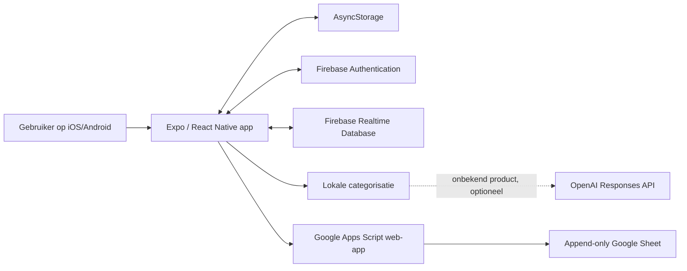
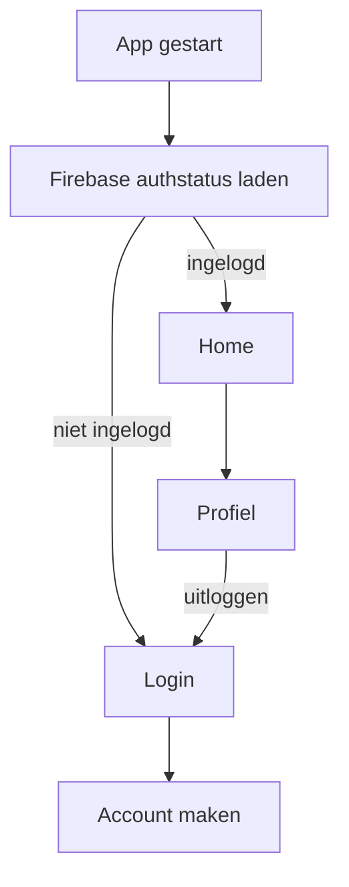

# SortIt technische specificatie

| Onderdeel | Waarde |
| --- | --- |
| Documentstatus | As-built specificatie, versie 1.0 |
| Laatst bijgewerkt | 2 augustus 2026 |
| Product | SortIt mobiele boodschappenlijst |
| Platforms | iOS en Android |
| App-ID | `com.casper.sortit` |
| Framework | Expo SDK 56 / React Native 0.85 |
| Backend | Firebase Authentication en Realtime Database |
| Data-archief | Google Sheets via Google Apps Script |

## 1. Doel en scope

SortIt helpt gebruikers hun boodschappen te ordenen volgens de looproute van
een gekozen supermarkt. De app ondersteunt meerdere lijsten, automatische en
handmatige productcategorisatie, offline gebruik, notities per lijst en een
append-only onderzoeksarchief in Google Sheets.

Deze specificatie beschrijft de huidige implementatie en geldt als technische
bron voor ontwikkeling, testen en deployment.

### 1.1 In scope

- Registreren, inloggen, uitloggen en accountbeheer.
- Meerdere boodschappenlijsten per gebruiker.
- Producten toevoegen, afvinken, verplaatsen en verwijderen.
- Supermarktgebonden categorievolgorde.
- Custom winkels met eigen logo en categorievolgorde.
- Personen aan categorieën toewijzen.
- Een vrij notitieveld per boodschappenlijst.
- Offline opslag en uitgestelde Firebase-synchronisatie.
- Append-only archivering van productacties in Google Sheets.
- Optionele toestemming voor naam, e-mail en locatie in het archief.
- Taalkeuze als opgeslagen gebruikersmetadata.

### 1.2 Niet in scope

- Betalingen, abonnementen of advertenties.
- Samen realtime aan één lijst werken via uitnodigingen.
- Achtergrondlocatie of continue locatiebewaking.
- Een beheerportaal voor spreadsheetgegevens.
- Volledige vertaling van alle appteksten. De taalkeuze is momenteel vooral
  metadata voor het archief.
- Een beveiligde serverproxy voor OpenAI of Google Apps Script. Dit is wel een
  productievereiste voordat de app breed publiek wordt aangeboden.

## 2. Systeemoverzicht



De mobiele app is de primaire client. AsyncStorage levert snelle lokale opslag
en offline continuïteit. Firebase is de centrale gebruikersopslag. Google
Sheets is uitsluitend een analysearchief en geen bron waaruit de app leest.

## 3. Technologie en hoofdcomponenten

| Component | Verantwoordelijkheid |
| --- | --- |
| `App.js` | Authstatus bewaken en navigatie tussen auth- en appschermen bepalen. |
| `Pages/HomeScreen.js` | Lijsten, producten, winkels, categorieën, notities en synchronisatie. |
| `Pages/LoginScreen.js` | Inloggen en wachtwoordherstel starten. |
| `Pages/CreateAccount.js` | Account aanmaken en eerste datatoestemmingen vastleggen. |
| `Pages/ProfielScreen.js` | Profiel, taal, toestemmingen, e-mail, wachtwoord en uitloggen. |
| `shoppingData.js` | Vaste winkels, routes, categorieën, iconen en lokale zoekwoorden. |
| `categoryService.js` | Lokale categorisatie met optionele AI-terugval. |
| `firebaseConfig.js` | Firebase-app, persistente Authentication en Realtime Database. |
| `dataSharing.js` | Toestemmingen, taalmetadata en foreground-locatie voor het archief. |
| `googleSheetsArchive.js` | HTTP-client voor append-only productrecords. |
| `google-apps-script/Code.gs` | Validatie, deduplicatie en toevoegen van spreadsheetregels. |
| `styles.js` | Centrale styling voor de mobiele interface. |

Belangrijkste runtime-afhankelijkheden zijn Expo, React Native, React
Navigation, Firebase, AsyncStorage, Expo Location, Expo Network, Expo Image
Picker en Expo Image Manipulator.

## 4. Navigatie en authenticatie

De app gebruikt een native stacknavigator zonder zichtbare standaardheaders.



### 4.1 Accountfuncties

- Registratie gebruikt e-mailadres en wachtwoord via Firebase Authentication.
- De ingevoerde naam wordt opgeslagen als Firebase `displayName`.
- Inloggen gebruikt e-mailadres en wachtwoord.
- Wachtwoordherstel wordt per e-mail gestart via Firebase.
- Een e-mailadreswijziging gebruikt een verificatielink naar het nieuwe adres.
- Authsessies worden met AsyncStorage op het apparaat bewaard.
- Alleen ingelogde gebruikers hebben toegang tot Home en Profiel.

## 5. Functionele specificatie

### 5.1 Boodschappenlijsten

- Iedere gebruiker heeft minimaal één lijst.
- Iedere lijst heeft een naam, supermarkt, categorie-indeling, producten,
  categorie-toewijzingen, notitie en aanmaaktijd.
- De actieve lijst wordt lokaal en in Firebase opgeslagen.
- De laatste overgebleven lijst mag niet worden verwijderd.
- Wisselen van lijst verandert geen inhoud van andere lijsten.

### 5.2 Producten

Een product ondersteunt de volgende acties:

- toevoegen;
- afvinken of opnieuw openen;
- handmatig naar een categorie slepen;
- individueel verwijderen;
- alle afgeronde producten verwijderen;
- de volledige actieve lijst leegmaken.

Een product bevat altijd een unieke ID, naam, categorie, completion-status en
aanmaaktijd. `completedAt` is `null` zolang het product niet afgerond is en
bevat een timestamp wanneer het wordt afgevinkt.

### 5.3 Categorisatie

1. De app zoekt eerst lokaal naar bekende zoekwoorden.
2. Zonder netwerk gebruikt de app uitsluitend de lokale uitkomst.
3. Met netwerk en een geconfigureerde OpenAI-sleutel mag de productnaam naar de
   Responses API worden gestuurd.
4. De AI mag alleen exact één categorie uit de aangeboden lijst teruggeven.
5. Bij een fout, timeout, ongeldige uitkomst of ontbrekende sleutel wordt de
   lokale uitkomst gebruikt.
6. Zonder geldige match komt het product in `Overig`.

De AI-aanroep heeft een timeout van acht seconden. `Overig` wordt oranje
weergegeven met het onderschrift `Nog te sorteren`.

### 5.4 Supermarkten

Standaard ondersteund:

- Lidl;
- Jumbo;
- Albert Heijn;
- Plus;
- Aldi;
- Spar.

Iedere standaardwinkel heeft een vaste categorievolgorde. Een custom winkel
heeft een gebruikersnaam, afbeeldingsdata, categorievolgorde en aanmaaktijd.
De gebruiker kan de categorievolgorde met pijlen aanpassen.

### 5.5 Categorie-toewijzingen

- De gebruiker kan personen aanmaken.
- Een categorie kan aan maximaal één persoon tegelijk worden toegewezen.
- Personen krijgen een stabiele kleurindex voor visuele herkenning.
- Toewijzingen worden per boodschappenlijst opgeslagen.

### 5.6 Notitieblok

- Het notitie-icoon staat boven het profielicoon.
- Aantikken vervangt het productgedeelte door een groot tekstveld.
- De bovenste lijstbediening, inclusief de prullenbak, blijft zichtbaar.
- De plusknop voor producten is verborgen zolang het notitieblok openstaat.
- Aantikken binnen het tekstveld bewerkt de notitie.
- Aantikken naast het tekstveld sluit het notitieblok en toont de lijst.
- Nogmaals op het notitie-icoon tikken sluit het notitieblok eveneens.
- Iedere lijst heeft een eigen notitie van maximaal 10.000 tekens.
- Notities worden lokaal opgeslagen en na 700 ms zonder nieuwe invoer naar
  Firebase gesynchroniseerd.
- Bij sluiten, lijstwissel, profielnavigatie of unmount wordt een wachtende
  notitie direct voor synchronisatie aangeboden.
- Notities worden niet naar Google Sheets verstuurd.

## 6. Gegevensmodel

### 6.1 Firebase-hoofdstructuur

```text
users/{uid}/shoppingList/
  activeListId
  lists/{listId}/
    id
    name
    selectedStore
    categoryAssignments/{category}: personId
    note
    createdAt
    items/{itemId}/...
  people/{personId}/...
  customStores/{storeId}/...
```

### 6.2 Boodschappenlijst

```json
{
  "id": "list-...",
  "name": "Weekboodschappen",
  "selectedStore": "Lidl",
  "categoryAssignments": {
    "Groente & Fruit": "person-..."
  },
  "note": "Vergeet de statiegeldbon niet",
  "createdAt": 1785686400000,
  "items": {}
}
```

### 6.3 Product

```json
{
  "id": "item-...",
  "name": "Melk",
  "category": "Zuivel",
  "completed": false,
  "createdAt": 1785686400000,
  "completedAt": null
}
```

### 6.4 Persoon

```json
{
  "id": "person-...",
  "name": "Sam",
  "colorIndex": 0,
  "createdAt": 1785686400000
}
```

### 6.5 Custom winkel

```json
{
  "id": "store-...",
  "name": "Buurtmarkt",
  "logoUri": "data:image/jpeg;base64,...",
  "categories": ["Groente & Fruit", "Brood", "Overig"],
  "isCustom": true,
  "createdAt": 1785686400000
}
```

## 7. Lokale opslag en offline synchronisatie

### 7.1 AsyncStorage

| Sleutel | Inhoud |
| --- | --- |
| `SHOPPING_LISTS_V2:{uid}` | Lijsten, actieve lijst, custom winkels en personen. |
| `SHOPPING_LISTS_PENDING_SYNC_V2` | Uitgestelde Firebase-operaties met gebruiker-ID. |
| `SHOPPING_ITEMS` | Legacy/compatibiliteitskopie van actieve producten. |
| `SELECTED_STORE` | Legacy/compatibiliteitskopie van actieve supermarkt. |
| `SORTIT_DATA_SHARING:{uid}` | Lokale toestemming voor naam, e-mail en locatie. |
| `SORTIT_APP_LANGUAGE` | Geselecteerde taalcode. |

### 7.2 Synchronisatiegedrag

- UI-wijzigingen worden eerst in lokaal React-state toegepast.
- De volledige lokale staat wordt vervolgens naar AsyncStorage geschreven.
- Iedere Firebase-mutatie wordt als operatie in een persistente wachtrij gezet.
- Zodra internet beschikbaar is, verwerkt de app operaties op volgorde.
- Pending operaties worden over Firebase-snapshots heen gelegd zodat een oude
  serverwaarde een nog niet gesynchroniseerde wijziging niet overschrijft.
- Na succesvolle Firebase-write wordt de operatie uit de wachtrij verwijderd.
- Mislukte operaties blijven staan en worden later opnieuw geprobeerd.

### 7.3 Koppeling met Google Sheets

Een productoperatie met archiefdata wordt eerst naar Google Sheets gestuurd en
pas daarna naar Firebase. Dit garandeert dat een Firebase-productactie niet
zonder bijbehorende spreadsheetregel wordt afgerond. Het gevolg is dat een
onbereikbare Sheets-web-app de centrale Firebase-synchronisatie van die
productoperatie tijdelijk blokkeert. Lokale bediening blijft wel beschikbaar.

## 8. Google Sheets-contract

### 8.1 Endpoint

- Methode: `POST`
- Content-Type: `text/plain;charset=utf-8`
- Body:

```json
{
  "records": [
    {
      "eventId": "data-sync-...-0",
      "userId": "firebase-uid",
      "supermarkt": "Lidl",
      "product": "Melk",
      "completed": true,
      "creationTime": "2026-08-02T10:00:00.000Z",
      "completionTime": "2026-08-02T10:05:00.000Z",
      "location": "52.123456, 5.123456",
      "language": "nl",
      "name": "",
      "email": ""
    }
  ]
}
```

### 8.2 Zichtbare kolommen

| Kolom | Bron |
| --- | --- |
| `ID` | Firebase gebruiker-ID. |
| `Stores` | Actieve supermarkt. |
| `Items` | Productnaam. |
| `Completion` | `true` of `false`. |
| `Creation Time` | ISO-tijd van productaanmaak. |
| `Completion Time` | ISO-tijd van afronding of leeg. |
| `Location` | Coördinaten indien afzonderlijk toegestaan. |
| `Language` | Geselecteerde taal, standaard `nl`. |
| `Name` | Firebase displayName indien afzonderlijk toegestaan. |
| `Email` | Firebase e-mailadres indien afzonderlijk toegestaan. |

### 8.3 Append-only en deduplicatie

- De Apps Script-code wijzigt of verwijdert geen bestaande datarijen.
- Iedere geldige actie bevat een uniek `eventId`.
- Een verborgen tabblad `_SortIt event ids` bewaart verwerkte event-ID's.
- Een script-lock voorkomt dubbele toevoegingen bij gelijktijdige requests.
- Een retry met hetzelfde event-ID resulteert niet in een dubbele zichtbare rij.
- De spreadsheet zelf blijft door de eigenaar handmatig bewerkbaar; append-only
  is dus een applicatiegarantie en geen cryptografische onveranderlijkheid.

## 9. Privacy en toestemmingen

### 9.1 Standaardinstelling

De drie optionele toestemmingen staan standaard uit:

- naam delen;
- e-mail delen;
- locatie delen.

De keuzes worden tijdens registratie aangeboden en kunnen later in het profiel
worden gewijzigd. Ze worden per gebruiker lokaal op het apparaat opgeslagen en
worden momenteel niet tussen apparaten gesynchroniseerd.

### 9.2 Locatie

- Alleen foreground-toestemming wordt gevraagd.
- Geen achtergrondlocatie en geen geofencing.
- Zonder app- én systeemtoestemming blijft het veld leeg.
- Eerst wordt een maximaal vijf minuten oude bekende positie met maximaal
  1.000 meter vereiste nauwkeurigheid geprobeerd.
- Als die niet beschikbaar is, vraagt de app een actuele positie met
  `Balanced`-nauwkeurigheid op.
- De locatie wordt pas opgehaald wanneer een archiefrecord wordt samengesteld.
- De waarde wordt als zes decimalen latitude en longitude opgeslagen.
- Bestaande spreadsheetregels worden nooit achteraf aangevuld.

### 9.3 Taal

Ondersteunde metadatacodes zijn `nl`, `en`, `de`, `fr`, `es` en `it`. De huidige
interface is grotendeels Nederlandstalig; de taalkeuze is nog geen volledig
i18n-systeem.

## 10. Configuratie

### 10.1 Environmentvariabelen

| Variabele | Vereist | Gebruik |
| --- | --- | --- |
| `EXPO_PUBLIC_GOOGLE_SHEETS_WEB_APP_URL` | Ja voor archivering | Gepubliceerde Apps Script-URL die eindigt op `/exec`. |
| `EXPO_PUBLIC_OPENAI_API_KEY` | Nee | Optionele AI-categorisatie; niet veilig voor productie in de client. |

`EXPO_PUBLIC_*`-waarden worden in de clientbundel opgenomen en zijn leesbaar
voor eindgebruikers. De Google Sheets-URL moet voor TestFlight/EAS als
Production environmentvariabele zijn ingesteld; een lokale `.env` verandert
een bestaande build niet.

### 10.2 Firebase

- E-mail/wachtwoord-authenticatie moet geactiveerd zijn.
- Realtime Database moet beschikbaar zijn voor de geconfigureerde project-ID.
- Databasebeveiliging moet iedere gebruiker beperken tot het eigen UID-pad.

Minimaal verwacht regelsconcept:

```json
{
  "rules": {
    "users": {
      "$uid": {
        ".read": "auth != null && auth.uid === $uid",
        ".write": "auth != null && auth.uid === $uid"
      }
    }
  }
}
```

De daadwerkelijke productie-regels moeten daarnaast velden, typen en maximale
lengtes valideren.

### 10.3 EAS

- Development: interne development client.
- Preview: interne distributie.
- Production: automatische buildnummerverhoging.
- App-versie komt uit EAS remote versioning.
- iOS TestFlight-submit gebruikt de geconfigureerde App Store Connect app-ID.
- Nieuwe native permissies of config-pluginwijzigingen vereisen een nieuwe
  binary; JavaScript- en environmentwijzigingen moeten minstens opnieuw worden
  gebundeld en gedistribueerd.

## 11. Beveiliging en productievoorwaarden

### 11.1 Huidige risico's

1. `EXPO_PUBLIC_OPENAI_API_KEY` is zichtbaar in de mobiele client en mag niet
   met een geheime productie-API-sleutel worden gevuld.
2. De Apps Script-web-app moet momenteel zonder Google-login bereikbaar zijn.
   Iedereen die de URL verkrijgt kan mogelijk zelf requests sturen.
3. Firebase-regels staan niet in deze repository en kunnen hier dus niet worden
   gereviewd of automatisch gedeployed.
4. Custom winkellogo's worden als data-URI in Realtime Database opgeslagen en
   kunnen de recordgrootte en bandbreedte sterk verhogen.
5. Toestemmingskeuzes staan alleen lokaal en kunnen per apparaat verschillen.
6. Google Sheets is operationeel gekoppeld aan Firebase-productwrites; een
   langdurige Sheets-storing kan een grote pending wachtrij veroorzaken.

### 11.2 Vereist vóór brede publieke release

- Verplaats OpenAI-verzoeken naar een beveiligde backend met rate limiting.
- Plaats een geauthenticeerde backend tussen de app en Google Sheets.
- Voeg Firebase Rules en emulator-tests toe aan versiebeheer.
- Voeg server-side payloadvalidatie, throttling en misbruikdetectie toe.
- Sla afbeeldingen op in object storage en alleen de URL in Realtime Database.
- Stel retentiebeleid en verwijderproces voor persoonsgegevens vast.
- Controleer privacybeleid en toestemmingscopy met juridisch advies.

## 12. Foutafhandeling

- Authfouten worden naar begrijpelijke meldingen vertaald.
- Categorisatiefouten vallen terug op lokale categorisatie of `Overig`.
- Locatiefouten leveren een leeg locatieveld op en blokkeren het product niet.
- Netwerkfouten houden Firebase-operaties in de persistente wachtrij.
- Een ongeldige Google Sheets-response houdt de bijbehorende operatie pending.
- Lokale opslagfouten tonen een foutmelding aan de gebruiker.
- Ontbrekende product-, lijst- of gebruikers-ID's worden defensief afgehandeld.

## 13. Niet-functionele eisen

### 13.1 Betrouwbaarheid

- Geen productactie mag verloren gaan door tijdelijk netwerkverlies.
- Een retry mag geen dubbele spreadsheetregel opleveren.
- Het tonen van het notitieblok mag de boodschappenlijst niet wijzigen.
- Bestaande spreadsheetdata mag niet door de integratie worden verwijderd.

### 13.2 Performance

- Lokale productinteracties moeten direct reageren zonder op netwerk te wachten.
- Notities worden gedebounced om niet per toetsaanslag naar Firebase te schrijven.
- AI-categorisatie stopt na maximaal acht seconden.
- Afbeeldingen worden voor opslag verkleind/geoptimaliseerd.

### 13.3 Toegankelijkheid

- Interactieve iconen hebben een accessibility label en button-role.
- Geselecteerde lijst- en notitiestatussen worden via accessibility state gemeld.
- Kleur mag niet de enige informatiebron zijn; `Overig` bevat daarom ook de
  tekst `Nog te sorteren`.

## 14. Teststrategie en acceptatiecriteria

### 14.1 Authenticatie

- Een geldig account kan worden aangemaakt en blijft ingelogd na herstart.
- Ongeldige of ontbrekende invoer toont een foutmelding.
- Wachtwoordherstel verstuurt een Firebase-e-mail.
- Uitloggen verwijdert toegang tot Home en Profiel.

### 14.2 Lijsten en producten

- Een nieuwe lijst verschijnt zonder andere lijsten te wijzigen.
- De laatste lijst kan niet worden verwijderd.
- Product toevoegen kiest een geldige categorie.
- Afvinken vult `completedAt`; terugzetten maakt `completedAt` weer `null`.
- Slepen wijzigt alleen de categorie van het gekozen product.
- Offline wijzigingen blijven na app-herstart zichtbaar en synchroniseren later.

### 14.3 Notitieblok

- Aantikken van het notitie-icoon verbergt de producten en opent het tekstveld.
- Tekst blijft behouden na sluiten, lijstwissel en app-herstart.
- Iedere lijst toont uitsluitend de eigen notitie.
- Aantikken naast het tekstveld keert terug naar de normale lijst.
- Aantikken in het tekstveld sluit het notitieblok niet.
- Notities verschijnen in Firebase maar niet in Google Sheets.
- De prullenbak blijft zichtbaar en de plusknop is in notitiemodus verborgen.

### 14.4 Google Sheets

- Een nieuwe productactie voegt precies één rij toe.
- Een retry met hetzelfde event-ID voegt geen tweede rij toe.
- Naam, e-mail en locatie zijn leeg wanneer de switches uitstaan.
- Alleen afzonderlijk toegestane velden worden gevuld.
- Een locatie wordt alleen aan nieuwe acties toegevoegd.
- Een storing verwijdert of wijzigt geen bestaande spreadsheetdata.

### 14.5 Releasecontrole

- `node --check` slaagt voor gewijzigde JavaScriptbestanden.
- `git diff --check` rapporteert geen whitespacefouten.
- Een Expo iOS-bundel kan succesvol worden gegenereerd.
- De Production environment bevat de Google Sheets `/exec`-URL.
- De geïnstalleerde TestFlight-build toont de iOS-locatieprompt.
- Firebase-regels zijn met twee verschillende testgebruikers gecontroleerd.

## 15. Observability

De huidige app gebruikt `console.warn` en `console.error`. Er is geen centrale
crashrapportage, tracing of metriekensysteem. Voor productie wordt aanbevolen:

- crashrapportage met release- en buildnummer;
- telling van pending synchronisatie-operaties;
- latency en foutpercentage van Apps Script;
- AI-timeouts en fallbackratio zonder productnamen te loggen;
- privacyvriendelijke events voor registratie, lijstgebruik en notitiemodus.

Logs mogen geen wachtwoorden, API-sleutels, volledige authtokens of onnodige
persoonsgegevens bevatten.

## 16. Aanbevolen vervolgstappen

Prioriteit 0, vóór publieke release:

1. Beveilig OpenAI en Sheets achter een eigen backend.
2. Versioneer en test Firebase Rules.
3. Voeg geautomatiseerde tests voor synchronisatie en deduplicatie toe.

Prioriteit 1:

1. Synchroniseer privacyvoorkeuren versleuteld tussen apparaten.
2. Ontkoppel Firebase-beschikbaarheid van een storing in Google Sheets met een
   server-side event/outbox-architectuur.
3. Verplaats custom winkellogo's naar object storage.
4. Voeg volledige lokalisatie toe of hernoem de huidige instelling naar
   `Voorkeurstaal`.

Prioriteit 2:

1. Voeg zoek- en filterfuncties toe aan grote lijsten.
2. Voeg export en accountverwijdering toe.
3. Voeg monitoring en een beheerbaar retentiebeleid toe.

## 17. Definition of Done

Een wijziging is gereed wanneer:

- het beschreven gebruikersgedrag werkt op iOS en Android;
- bestaande lokale en Firebase-data compatibel blijven;
- geen onbedoelde verwijdering of mutatie van spreadsheetdata plaatsvindt;
- offline gedrag en retries zijn getest;
- nieuwe persoonsgegevens en permissies in het privacybeleid staan;
- environment- en deploymentstappen zijn gedocumenteerd;
- syntax-, bundel- en relevante handmatige acceptatietests slagen.
