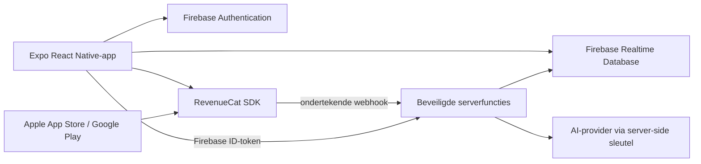

# Technische specificatie: Premium kookprofiel, slimme boodschappenlijst en AI-suggesties

## 1. Status en doel

Dit document beschrijft een toekomstige uitbreiding van SortIt. Er wordt met deze specificatie nog geen applicatiecode, Firebase-configuratie of betaalconfiguratie aangepast.

Het doel is een betaald Premium-abonnement waarmee een ingelogde gebruiker:

1. op basis van de eigen opgeslagen producthistorie een uitlegbaar kook- en boodschappengedragsprofiel krijgt;
2. vanuit dat profiel een voorstel voor een boodschappenlijst kan laten genereren;
3. tijdens het maken of bekijken van een lijst relevante aanvullende producten en eenvoudige maaltijdideeën krijgt;
4. iedere suggestie zelf accepteert, negeert of afwijst.

De bestaande gratis boodschappenlijst, handmatige categorisatie en winkelsortering blijven beschikbaar. Historische data die vóór de introductie van Premium al volgens het privacybeleid is opgeslagen, mag pas voor personalisatie worden verwerkt nadat de gebruiker Premium activeert en daarvoor expliciet toestemming geeft.

## 2. Productbeslissingen

### 2.1 Premium-recht

Er komt één entitlement: `premium_ai`. De app kan daar maand- en jaarproducten aan koppelen. Exacte product-ID's en prijzen worden vóór implementatie in App Store Connect en Google Play Console vastgesteld en horen niet hardcoded in de gebruikersinterface.

Premium geeft toegang tot:

- het kookgedragsprofiel;
- een gegenereerd boodschappenlijstvoorstel;
- AI-aanvulsuggesties en maaltijdideeën;
- feedbackgestuurde personalisatie.

De gebruiker kan aankopen herstellen en het abonnement via de betreffende appstore beheren. Opzeggen beëindigt de toegang pas wanneer de reeds betaalde periode of toepasselijke respijtperiode afloopt.

### 2.2 Geen automatische mutaties

Het systeem schrijft nooit zelfstandig AI-uitvoer naar de actieve boodschappenlijst. Iedere producttoevoeging vereist een expliciete actie zoals **Toevoegen**, **Alles toevoegen** of **Vervangen**. Voor **Alles toevoegen** toont de app vooraf hoeveel producten nieuw zijn en welke dubbelen worden overgeslagen.

### 2.3 Uitlegbaar en corrigeerbaar profiel

Het profiel toont niet alleen conclusies, maar ook de reden, bijvoorbeeld: `Je koopt gemiddeld iedere 7 dagen pasta (8 waarnemingen in 12 weken)`. De gebruiker kan:

- een conclusie corrigeren of uitschakelen;
- producten of categorieën uitsluiten van personalisatie;
- dieetwensen, allergieën, huishoudgrootte, budgetvoorkeur en gewenste planperiode zelf instellen;
- het profiel opnieuw laten berekenen;
- alle afgeleide profiel- en feedbackdata verwijderen.

## 3. Huidige uitgangssituatie

SortIt is een Expo/React Native-app met Firebase Authentication, Firebase Realtime Database en AsyncStorage. De relevante bestaande datasets zijn:

```text
users/{uid}/shoppingList
users/{uid}/productArchive/{eventId}
```

`productArchive` bevat append-only productacties zoals `created`, `completed`, `reopened` en `deleted`, met onder andere productnaam, categorie, winkel en tijdstippen. Deze events zijn de primaire bron voor gedragsanalyse. De actuele lijst is alleen context voor lijstgeneratie en suggesties.

De betaal- en AI-uitbreiding vereist servercode. Geheime API-sleutels mogen niet in de Expo-app, `.env`-waarden die in de appbundle terechtkomen of Realtime Database staan.

## 4. Voorgestelde architectuur



Voorgestelde techniek:

- `react-native-purchases` en RevenueCat voor StoreKit/Google Play Billing, aankoopherstel en entitlement-normalisatie;
- een development build/EAS Build, omdat native in-app-purchasecode niet in Expo Go werkt;
- Firebase Cloud Functions of een vergelijkbare beveiligde backend voor entitlementcontrole, profielberekening, rate limiting en AI-aanroepen;
- Firebase App Check als extra bescherming van callable endpoints;
- een server-side AI-aanroep met een strikt JSON-schema en zonder schrijfbevoegdheid naar boodschappenlijsten.

RevenueCat gebruikt de Firebase `uid` als niet-gokbare `appUserID`, zodat aankopen aan het ingelogde account zijn gekoppeld. Bij in- en uitloggen moet de SDK-identiteit expliciet mee wisselen. De server vertrouwt voor toegang niet uitsluitend op een door de client aangeleverde boolean.

## 5. Gebruikersstromen

### 5.1 Aankoop

1. Een gratis gebruiker opent een Premium-functie.
2. De app toont de paywall met actuele storeprijzen, factureringsperiode, voorwaarden, privacylink en herstelknop.
3. De gebruiker koopt via Apple of Google; betaalgegevens komen niet bij SortIt terecht.
4. RevenueCat levert bijgewerkte `CustomerInfo` en stuurt een webhook naar de backend.
5. De backend verwerkt het webhook-event idempotent en materialiseert de entitlementstatus.
6. De app ververst de status en ontgrendelt Premium.
7. Voor de eerste profielberekening vraagt de app afzonderlijk toestemming voor personalisatie.

### 5.2 Eerste kookprofiel

1. De gebruiker vult optioneel huishoudgrootte, dieet, allergieën, ongewenste ingrediënten, budget en planperiode in.
2. De server controleert Firebase-authenticatie, App Check, actieve entitlement en toestemming.
3. Een deterministische analysetaak aggregeert de productevents over standaard 12 weken.
4. De app toont profielkenmerken met bewijssterkte en een optie om ze te corrigeren.
5. Alleen de door de gebruiker bevestigde instellingen gelden als harde beperkingen.

### 5.3 Boodschappenlijst genereren

1. De gebruiker kiest een periode, bijvoorbeeld 7 dagen, en eventueel een winkel en budgetniveau.
2. De backend combineert herhaalproducten, ontbrekende basisproducten, profielvoorkeuren, expliciete beperkingen en de huidige lijst.
3. De AI-service structureert dit tot productvoorstellen en maaltijdideeën.
4. De backend valideert de uitvoer en retourneert suggesties met reden en confidence.
5. De gebruiker selecteert voorstellen en voegt die toe via de bestaande normale productactieflow. Hierdoor blijven het archief en de offline wachtrij correct werken.

### 5.4 Suggesties tijdens het lijst maken

Na toevoegen, verwijderen of openen van een lijst start de client een debounce van circa 800 ms. De client vraagt alleen opnieuw suggesties aan wanneer de genormaliseerde lijstinhoud wezenlijk is veranderd. De server retourneert maximaal vijf voorstellen, bijvoorbeeld:

- een vaak samen gekocht product: `Je koopt taco's vaak met kidneybonen`;
- een waarschijnlijk vergeten basisproduct: `Melk staat meestal wekelijks op je lijst`;
- een aanvulling op een maaltijdcluster: `Pasta + tomatensaus → eventueel courgette`;
- een maaltijdidee op basis van meerdere reeds aanwezige producten.

Suggesties worden als aparte kaarten getoond, niet als echte lijstregels. Afwijzen verbergt het voorstel en levert feedback. Suggesties vervallen zodra de lijstcontext verandert of na 24 uur.

## 6. Profielberekening

### 6.1 Bronselectie en normalisatie

De analysetaak verwerkt alleen events van de ingelogde gebruiker en dedupliceert op `eventId` en productlevenscyclus. Standaard telt een aankoopintentie wanneer een product `completed` wordt. Als er onvoldoende completion-data is, kan `created` als zwakker signaal dienen. Verwijderde, heropende en dubbel gesynchroniseerde events worden correct verrekend.

Productnamen worden genormaliseerd met behoud van het origineel:

- trimmen en hoofdletterongevoelig vergelijken;
- leestekens en meervoudige spaties normaliseren;
- bekende aliassen koppelen, bijvoorbeeld `spaghetti` aan het productconcept `pasta`, zonder verschillende ingrediënten onterecht samen te voegen;
- categorie en winkel als aanvullende context gebruiken.

### 6.2 Afgeleide kenmerken

De eerste versie berekent deterministisch:

| Kenmerk | Berekening | Gebruik |
| --- | --- | --- |
| Herhaalfrequentie | mediaan en spreiding tussen completions | voorspellen wanneer een product opnieuw nodig is |
| Categorieverdeling | aandeel completions per categorie | profielweergave en gebalanceerde suggesties |
| Samen-aankopen | co-occurrence binnen dezelfde lijst/koopperiode | relevante aanvullingen |
| Winkelvoorkeur | aandeel per `currentStore` | sortering en winkelcontext |
| Lijstgrootte | mediaan van afgeronde producten per lijst/periode | hoeveelheid voorstellen begrenzen |
| Koopritme | dagen en tijdsintervallen met voldoende waarnemingen | voorgestelde planperiode |
| Nieuw versus herhaal | verhouding nieuwe tot terugkerende productconcepten | variatie bepalen |

Per kenmerk worden `sampleSize`, `windowStart`, `windowEnd`, `confidence` en een leesbare uitleg opgeslagen. Minder dan drie relevante waarnemingen geeft geen harde conclusie. Recente gebeurtenissen wegen zwaarder via een gedocumenteerde time-decay, maar worden nooit als zekerheid gepresenteerd.

### 6.3 Geen gevoelige inferenties

De analysetaak leidt geen gezondheidstoestand, religie, etniciteit, zwangerschap, financiële situatie of andere gevoelige persoonsgegevens af uit producten. Allergieën, dieet en budget worden uitsluitend toegepast wanneer de gebruiker ze zelf expliciet invult. Een productnaam alleen is nooit bewijs van een allergie of dieet.

## 7. Suggestie- en AI-pijplijn

### 7.1 Hybride ontwerp

Niet ieder voorstel vereist generatieve AI. De backend maakt eerst deterministische kandidaten:

1. terugkerende producten waarvan de verwachte herhaaldatum nadert;
2. sterke samen-aankopen die nog niet op de lijst staan;
3. door de gebruiker ingestelde basisproducten;
4. producten die strijdig zijn met een harde beperking verwijderen;
5. dubbelen met de actuele lijst en eerdere suggesties verwijderen.

De AI rangschikt en formuleert kandidaten en kan eenvoudige maaltijdcombinaties maken. Hierdoor zijn kosten, latency en hallucinaties lager dan bij een volledig vrije prompt.

### 7.2 Minimale AI-input

De AI-provider ontvangt geen `uid`, e-mailadres, exacte tijden, locatie/adres, vrije profieltekst of volledige ruwe producthistorie. De server stuurt alleen:

- geaggregeerde voorkeurssignalen;
- een beperkte set genormaliseerde productconcepten;
- huidige lijstproducten;
- expliciet ingestelde dieet- en allergiebeperkingen;
- taal, land, planperiode en maximaal budgetniveau;
- deterministisch berekende kandidaten.

### 7.3 Gestructureerde uitvoer

De AI-respons moet aan een schema voldoen, bijvoorbeeld:

```json
{
  "suggestions": [
    {
      "type": "product",
      "name": "Kidneybonen",
      "category": "Conserven",
      "quantityText": "1 blik",
      "reason": "Past bij de taco-ingrediënten op je lijst",
      "confidence": 0.82,
      "sourceSignals": ["list_context", "co_purchase"]
    }
  ],
  "mealIdeas": [
    {
      "title": "Groentetaco's",
      "usesExisting": ["Tortilla's", "Paprika"],
      "missingProducts": ["Kidneybonen"],
      "reason": "Gebruikt twee producten die al op je lijst staan"
    }
  ]
}
```

Servervalidatie controleert schema, maximale aantallen, tekstlengte, categorieën, dubbelen, verboden ingrediënten en confidencebereik. Ongeldige uitvoer wordt eenmaal met een reparatieprompt geprobeerd; daarna valt het endpoint terug op deterministische suggesties. De app toont geen medisch, voedingskundig of financieel advies.

### 7.4 Ranking

Een voorstel krijgt een samengestelde score, bijvoorbeeld:

```text
score = 0,35 * recurrence
      + 0,25 * coPurchase
      + 0,20 * currentListRelevance
      + 0,10 * recency
      + 0,10 * acceptedFeedback
      - duplicatePenalty
      - rejectedFeedbackPenalty
```

Gewichten zijn serverconfiguratie en worden met offline evaluaties gekalibreerd. Harde dieet-, allergie- en uitsluitingsregels worden vóór ranking toegepast en kunnen niet door het model worden overschreven.

## 8. API-contracten

Alle endpoints vereisen een geldig Firebase ID-token. Premium-endpoints controleren bovendien `premium_ai` server-side.

### `POST /v1/profile/rebuild`

Start of vernieuwt de profielberekening. De operatie gebruikt een idempotency key en retourneert `profileVersion`, status en eventueel `retryAfterSeconds`.

### `GET /v1/profile`

Retourneert alleen de materialized profielkenmerken, instellingen en bewijsmetadata; niet de volledige producthistorie.

### `PUT /v1/profile/preferences`

Valideert en bewaart expliciete gebruikersvoorkeuren en toestemming. Voor allergieën geldt een vaste, genormaliseerde lijst plus optionele uitgesloten ingrediënten.

### `POST /v1/suggestions/list`

Input: `listId`, genormaliseerde huidige lijst-hash, planperiode en optionele winkel/budgetinstelling. Output: een `suggestionSetId`, profielversie, vervaltijd en gevalideerde voorstellen.

### `POST /v1/suggestions/{suggestionSetId}/feedback`

Input: `suggestionId` en `accepted`, `rejected` of `dismissed`. De server accepteert een feedbackevent één keer en bewaart geen vrije tekst in versie 1.

### `POST /v1/subscriptions/webhook`

Alleen voor RevenueCat. Verifieert het ingestelde authorization secret, dedupliceert op webhook-event-ID en verwerkt events buiten volgorde op basis van de effectieve transactietijd. De endpoint logt geen volledige payloads of betaalidentifiers.

## 9. Datamodel

Nieuwe server-beheerde paden:

```text
users/{uid}/
  premium/
    entitlement/
      id: "premium_ai"
      active: true
      productId: "..."
      store: "app_store" | "play_store"
      environment: "sandbox" | "production"
      expiresAt: 1788134400000
      willRenew: true
      updatedAt: 1785542400000
  personalization/
    consent/
      granted: true
      version: "1.0"
      grantedAt: 1785542400000
    preferences/
      householdSize: 2
      planningDays: 7
      dietTags: []
      allergens: []
      excludedIngredients: []
      budgetLevel: "standard"
    profile/
      version: 4
      sourceWindowStart: 1775260800000
      sourceWindowEnd: 1785542400000
      generatedAt: 1785542410000
      features: {}
    suggestionSets/
      {suggestionSetId}/
        listId: "default"
        listHash: "sha256:..."
        profileVersion: 4
        createdAt: 1785542420000
        expiresAt: 1785628820000
        suggestions: {}
    feedback/
      {feedbackId}/
        suggestionSetId: "..."
        suggestionId: "..."
        action: "accepted"
        createdAt: 1785542430000
```

De client mag `premium/entitlement` en `personalization/profile` lezen, maar niet schrijven. Voorkeuren worden via de backend geschreven zodat validatie, toestemming en auditvelden niet kunnen worden omzeild. Suggesties mogen na korte retentie worden verwijderd; geaccepteerde producten bestaan daarna uitsluitend via de normale `shoppingList`- en `productArchive`-flow.

## 10. Toegangscontrole en offline gedrag

- De UI mag de laatst bekende entitlement cachen voor snelle weergave, maar de backend beslist over iedere kostbare Premium-operatie.
- Bij tijdelijk netwerkverlies blijven bestaande handmatige lijstfuncties werken.
- Het laatst berekende profiel en nog geldige suggesties mogen read-only uit lokale cache worden getoond met label **Mogelijk verouderd**.
- Nieuwe AI-generatie, aankoop en aankoopherstel vereisen netwerk.
- Bij een verlopen entitlement kan de gebruiker zijn bestaande lijst blijven gebruiken en zijn profieldata bekijken/verwijderen, maar niet opnieuw genereren.
- De backend weigert cross-user `listId`-toegang en leest de actuele lijst zelf uit Firebase; de client kan geen historie van een andere gebruiker meesturen.

Firebase-regels moeten server-beheerde velden voor clients read-only maken. Backendwrites gebruiken Admin SDK en bypass-en clientregels alleen binnen gecontroleerde functies.

## 11. Privacy, beveiliging en compliance

Voor livegang zijn een privacy-impactanalyse en bijgewerkte privacyverklaring nodig. Minimaal geldt:

- aparte, intrekbare toestemming voor profilering/personalisatie;
- duidelijke uitleg dat eerdere eigen boodschappenhistorie wordt gebruikt;
- dataminimalisatie richting AI-provider;
- een verwerkersovereenkomst en passende dataretentie-instellingen met de AI-provider;
- verwijdering van profiel, suggesties, feedback en consent bij accountverwijdering;
- na intrekken van toestemming stopt nieuwe verwerking direct en worden afgeleide data verwijderd;
- geen API-sleutels, webhooksecrets of RevenueCat secret keys in de app;
- secret management, sleutelrotatie, beperkte IAM-rechten en geschoonde logs;
- rate limiting per gebruiker en endpoint, request-size-limieten en misbruikdetectie;
- aankoopstatus nooit afleiden uit een door de client geschreven Firebase-veld;
- gebruikersdata niet gebruiken om algemene modellen te trainen zonder een nieuwe, afzonderlijke en expliciete toestemming.

De gegevensretentie wordt vóór implementatie juridisch vastgesteld. Technisch voorstel: suggestion sets 30 dagen, feedback maximaal 12 maanden en het materialized profiel zolang toestemming actief is. Ruwe producthistorie behoudt de bestaande retentie; de Premium-service maakt er geen tweede kopie van.

## 12. Kosten, quota en betrouwbaarheid

Om onverwachte AI-kosten te voorkomen:

- maximaal één interactieve suggestieaanvraag per 10 seconden per gebruiker;
- debounce en cache op `uid + profileVersion + listHash + instellingen`;
- standaard maximaal 20 AI-generaties per dag, server-side configureerbaar;
- token-, timeout- en outputlimieten per request;
- dagelijkse projectbudgetwaarschuwingen en een kill switch;
- deterministische fallback bij timeout, providerstoring, quota of ongeldige output;
- geen automatische retries vanuit de client; de backend gebruikt maximaal één begrensde retry.

Belangrijke metrics zijn entitlement-checkfouten, profielduur, AI-latency, schemafouten, cache-hitratio, suggestie-acceptatie, afwijzingen, kosten per actieve Premium-gebruiker en fallbackpercentage. Logs bevatten correlation IDs maar geen volledige boodschappenlijst of promptinhoud.

## 13. Implementatiefasen

### Fase 0 — product en compliance

- Prijs, proefperiode, entitlement en storeproducten vaststellen.
- Privacytekst, toestemming, retentie en AI-provider beoordelen.
- Meetplan en succescriteria vastleggen.

### Fase 1 — abonnement

- RevenueCat-project, Apple/Google-producten en `premium_ai` configureren.
- Development builds en SDK-integratie toevoegen.
- Paywall, aankoop, herstel, beheerlink en entitlementcache bouwen.
- Webhookontvanger en server-side entitlementmaterialisatie implementeren.

### Fase 2 — deterministisch profiel

- Eventnormalisatie, deduplicatie en featureberekening bouwen.
- Profiel- en voorkeureninterface met toestemming en correcties toevoegen.
- Nog geen generatieve AI activeren; eerst datakwaliteit meten.

### Fase 3 — lijstgenerator en suggesties

- Kandidaatgenerator, AI-gateway, JSON-validatie, cache en fallback bouwen.
- Suggestiekaarten en expliciete acceptatie aan de bestaande productflow koppelen.
- Feedbackevents en quota toevoegen.

### Fase 4 — gecontroleerde uitrol

- Sandbox- en storetests afronden.
- Interne gebruikers, daarna een kleine feature-flagcohort.
- Kwaliteit, kosten en privacyincidenten bewaken voordat brede uitrol volgt.

## 14. Teststrategie

### 14.1 Unit- en contracttests

- Eventreeksen met create/complete/reopen/delete leveren geen dubbeltellingen op.
- Productnormalisatie voegt alleen bekende aliassen samen.
- Profielconfidence daalt bij weinig of inconsistente data.
- Harde allergie- en dieetfilters verwijderen conflicterende kandidaten vóór de AI-aanroep.
- JSON-schema weigert onbekende velden, te lange tekst en ongeldige categorieën.
- De fallback retourneert bruikbare deterministische suggesties zonder AI.
- Dezelfde idempotency key maakt geen dubbele profieltaak, feedback of webhookmutatie.

### 14.2 Abonnementstests

- Nieuwe aankoop, proefperiode, verlenging, opzegging, respijtperiode, billing issue, expiratie, refund en herstel.
- Webhooks die dubbel of buiten volgorde aankomen veranderen de eindstatus niet foutief.
- Uitloggen en inloggen als een ander account lekt geen entitlement of profielcache.
- Sandbox-aankopen kunnen productie-entitlements niet vervuilen.

### 14.3 End-to-endtests

- Gratis gebruiker ziet paywall en kan Premium-endpoints niet direct aanroepen.
- Premium-gebruiker zonder toestemming krijgt nog geen profiel.
- Toestemming intrekken verwijdert afgeleide data en blokkeert nieuwe personalisatie.
- Suggestie accepteren maakt precies één normale productactie en archiefevent.
- Offline blijven handmatige lijsten werken; AI toont een duidelijke offline status.
- Accountverwijdering verwijdert alle nieuwe gebruikersdata.
- Prompt-injectionachtige productnamen veranderen geen instructies en verschijnen niet ongefilterd als modelinstructie.

## 15. Acceptatiecriteria voor versie 1

- Premium-toegang is aantoonbaar gebaseerd op een door de store gevalideerde entitlement.
- Een gebruiker kan kopen, herstellen, beheren en na expiratie correct worden geblokkeerd.
- Het profiel gebruikt alleen de eigen data, toont bronperiode en bewijssterkte en is corrigeerbaar.
- Zonder expliciete personalisatietoestemming wordt geen profiel of AI-suggestie gegenereerd.
- Gevoelige kenmerken worden niet uit boodschappen afgeleid.
- De AI-provider ontvangt geen accountidentiteit, adres of volledige ruwe historie.
- Iedere modelrespons wordt server-side gevalideerd en heeft een deterministische fallback.
- Geen enkele suggestie wijzigt een lijst zonder expliciete gebruikersactie.
- Geaccepteerde items lopen door de bestaande offline-, Firebase- en archiefflow.
- Rate limits, quota, monitoring, verwijdering en consent-intrekking zijn getest.
- De gratis kernfunctionaliteit blijft werken wanneer RevenueCat, de backend of de AI-provider niet beschikbaar is.

## 16. Buiten scope van versie 1

- Automatisch bestellen of afrekenen bij supermarkten.
- Prijsvergelijking of actuele voorraad zonder een aparte betrouwbare databron.
- Volledige recepten met gegarandeerde voedingswaarden.
- Medisch of voedingskundig advies.
- Achtergrondgeneratie zonder gebruikersactie.
- Delen van één Premium-entitlement tussen verschillende SortIt-accounts buiten de regels van Apple/Google.
- Gebruik van producthistorie voor advertenties of training van algemene modellen.

## 17. Open productkeuzes vóór implementatie

De volgende keuzes blokkeren de technische basis niet, maar moeten vóór Fase 1 definitief zijn:

- maandprijs, jaarprijs en eventuele proefperiode;
- welke gratis preview de paywall toont;
- standaard analysevenster (voorstel: 12 weken) en minimale hoeveelheid historie;
- dagquota en fair-usecommunicatie;
- ondersteunde talen bij lancering;
- definitieve AI-provider, regio, bewaarbeleid en model;
- juridische retentietermijnen en precieze consenttekst;
- of huishoudgrootte en budget in versie 1 worden opgenomen of pas later.
