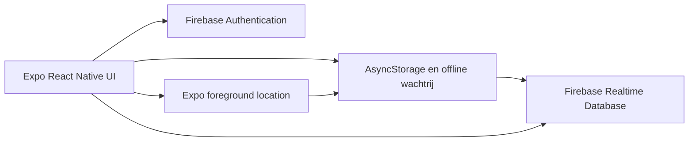

# SortIt technische specificatie

## 1. Doel

SortIt is een Expo/React Native-app voor boodschappenlijsten. Producten worden per supermarkt in een bruikbare loopvolgorde gezet. Firebase is de enige online gegevensopslag.

De app heeft drie verschillende Firebase-datasets:

1. `shoppingList`: de actuele, bewerkbare toestand van de app;
2. `productArchive`: append-only historie van productacties;
3. `storeConfirmations`: append-only antwoorden op de vraag of de gebruiker bij de geselecteerde winkel is.

## 2. Functionele scope

- Registreren, inloggen, uitloggen en wachtwoord herstellen.
- Meerdere boodschappenlijsten maken, selecteren en verwijderen.
- Producten toevoegen, categoriseren, verslepen, afvinken en verwijderen.
- Afgeronde producten of een volledige lijst opruimen.
- Een notitieblok op de plaats van de productlijst tonen.
- Personen aan categorieën koppelen.
- Een land kiezen: Nederland, België of Duitsland.
- Alleen supermarkten van het gekozen land tonen.
- Eigen supermarkten en categorievolgordes beheren.
- Offline wijzigingen lokaal in een wachtrij bewaren.
- Bij herstel van de verbinding naar Firebase synchroniseren.
- Elke productactie blijvend in Firebase archiveren.
- Optioneel lokaal locatie gebruiken om zonder coördinaten in Firebase een winkelbezoek te laten bevestigen.

## 3. Architectuur



Er is geen tweede online datastore. Alle online app- en archiefgegevens staan in Firebase.

## 4. Belangrijkste componenten

| Bestand | Verantwoordelijkheid |
| --- | --- |
| `App.js` | Navigatie en authenticatiestatus. |
| `Pages/HomeScreen.js` | Lijsten, producten, offline wachtrij en Firebase-archief. |
| `Pages/ProfielScreen.js` | Profiel, landkeuze en locatietoestemming. |
| `Pages/CreateAccount.js` | Accountregistratie. |
| `Pages/LoginScreen.js` | Inloggen en wachtwoordherstel. |
| `dataSharing.js` | Lokale toestemming voor winkelherkenning. |
| `storePresence.js` | Lokale 150-metercontrole, GPS-begrenzing en antwoordcache. |
| `categoryService.js` | Lokale productcategorisatie. |
| `shoppingData.js` | Landen, supermarkten, categorieën en looproutes. |
| `firebaseConfig.js` | Firebase-clientconfiguratie. |

## 5. Firebase-datamodel

### 5.1 Hoofdstructuur

```text
users/
  {uid}/
    shoppingList/
      activeListId
      lists/
      customStores/
      people/
    productArchive/
      {eventId}/
    storeConfirmations/
      {confirmationId}/
```

### 5.2 Actueel product

Pad:

```text
users/{uid}/shoppingList/lists/{listId}/items/{itemId}
```

Voorbeeld:

```json
{
  "id": "item-1785751200000abc123",
  "name": "Melk",
  "category": "Zuivel",
  "completed": false,
  "createdAt": 1785751200000,
  "completionTime": "",
  "currentStore": "Lidl"
}
```

`completionTime` is een Unix-tijd in milliseconden zodra het product is afgerond en anders een lege string.

### 5.3 Productarchief

Pad:

```text
users/{uid}/productArchive/{eventId}
```

Voorbeeld:

```json
{
  "userId": "firebase-user-id",
  "itemId": "item-1785751200000abc123",
  "listId": "default",
  "action": "completed",
  "name": "Melk",
  "category": "Zuivel",
  "completed": true,
  "createdAt": 1785751200000,
  "completionTime": 1785754800000,
  "currentStore": "Lidl",
  "location": {
    "storeName": "Lidl",
    "address": "Voorbeeldstraat 12, 1234 AB Utrecht, Nederland",
    "confirmedAt": 1785754700000,
    "confirmationId": "store-confirmation-1785754700000abc123"
  },
  "archivedAt": 1785754800000
}
```

Mogelijke acties:

- `created`
- `category_changed`
- `completed`
- `reopened`
- `deleted`
- `cleared_completed`
- `list_cleared`
- `list_deleted`
- `location_attached`

Een actie krijgt altijd een nieuw `eventId`. De app werkt bestaande archiefrecords niet bij en verwijdert ze niet.

### 5.4 Winkelbevestiging

Pad:

```text
users/{uid}/storeConfirmations/{confirmationId}
```

Voorbeeld:

```json
{
  "userId": "firebase-user-id",
  "confirmationId": "store-confirmation-1785754800000abc123",
  "storeName": "Lidl",
  "storeAddress": "Voorbeeldstraat 12, 1234 AB Utrecht, Nederland",
  "confirmed": true,
  "answeredAt": 1785754800000,
  "radiusMeters": 150
}
```

Dit record bevat geen coördinaten. `storeAddress` wordt alleen gevuld na **Ja** en kan leeg zijn als omgekeerde geocodering geen adres oplevert.

## 6. Schrijfvolgorde en offline gedrag

Voor een productactie maakt de app twee wachtrijoperaties:

1. een append-only write naar `productArchive/{eventId}`;
2. de actuele wijziging onder `shoppingList`.

Het archiefrecord staat bewust eerst. Bij een verwijderactie wordt de historie daardoor opgeslagen voordat het actuele product verdwijnt.

De volledige wachtrij staat in AsyncStorage onder `SHOPPING_LISTS_PENDING_SYNC_V2`. Alleen operaties van de ingelogde gebruiker worden uitgevoerd. Na een succesvolle Firebase-write wordt uitsluitend die operatie uit de lokale wachtrij gehaald. Bij een netwerkfout blijft ze staan voor een latere retry.

Product- en archiefoperaties hebben voorrang op `storeConfirmation`-operaties. Een vertraagde of geweigerde winkelbevestiging kan daardoor latere boodschappenwijzigingen niet blokkeren.

Archiefoperaties worden niet over de actuele lokale lijst geprojecteerd wanneer een Firebase-snapshot binnenkomt.

## 7. Tijden

- `createdAt`: moment waarop het product is aangemaakt.
- `completionTime`: meest recente moment waarop het product werd afgerond; leeg na heropenen.
- `archivedAt`: moment waarop de archiefactie lokaal werd gemaakt.

Alle tijden zijn Unix-tijden in milliseconden. Hierdoor blijven sorteren en locale weergave eenduidig.

## 8. Winkel

`currentStore` bevat de geselecteerde winkel op het moment van de productactie. De lijst bewaart daarnaast zijn eigen `selectedStore`, zodat de UI na opnieuw openen dezelfde winkel toont.

Na een bevestigend winkelantwoord is de adreslocatie één uur geldig voor precies die lijst en winkel. Producten die in dat venster worden afgevinkt krijgen `location` in zowel het actuele item als het archiefevent. Als de bevestiging volgt op het afvinken, worden reeds afgevinkte items uit het voorafgaande uur op diezelfde lijst via een append-only `location_attached`-event gekoppeld. Dit veld bevat nooit GPS-coördinaten.

Bij een landwijziging toont de app de bijbehorende standaardwinkels:

- Nederland: Lidl, Jumbo, Albert Heijn, Plus, Aldi en Spar.
- België: Colruyt, Delhaize, Carrefour en Aldi.
- Duitsland: Edeka, Rewe, Aldi, Lidl en Kaufland.

## 9. Winkelherkenning en toestemming

De profielschakelaar `allowStorePresence` staat standaard uit en wordt per gebruiker lokaal opgeslagen. De eerdere toestemming voor het opslaan van coördinaten wordt niet overgenomen.

Toevoegen, afvinken en heropenen verwerken de UI en Firebase-write direct. Daarna wacht de app vijf seconden op rust. De app gebruikt dan een voldoende nauwkeurige recente locatie of vraagt, maximaal één keer per uur, een nieuwe gebalanceerde voorgrondlocatie op.

De vraag **Ben je nu bij [geselecteerde winkel]?** verschijnt als niet-blokkerende banner. Na **Ja** of **Nee** wordt dezelfde vraag één uur lang niet herhaald binnen 150 meter van de lokaal opgeslagen antwoordpositie.

Alle GPS-coördinaten blijven lokaal. Firebase ontvangt winkelnaam, een alleen na **Ja** bevestigd adres, antwoord, antwoordtijd en de ingestelde straal. Er is geen achtergrondlocatie.

Nieuwe operaties sanitizen `location` tot uitsluitend winkelnaam, adres, bevestigingstijd en de verwijzing naar de bevestiging. Oude locatievormen met GPS-coördinaten worden bij het laden verwijderd of naar deze veilige vorm teruggebracht.

## 10. Beveiligingsregels

Minimale aanbevolen Realtime Database-regels:

```json
{
  "rules": {
    "users": {
      "$uid": {
        ".read": "$uid === auth.uid",
        "shoppingList": {
          ".write": "$uid === auth.uid"
        },
        "productArchive": {
          "$eventId": {
            ".write": "$uid === auth.uid && !data.exists() && newData.exists()"
          }
        },
        "storeConfirmations": {
          "$confirmationId": {
            ".write": "$uid === auth.uid && !data.exists() && newData.exists()"
          }
        }
      }
    }
  }
}
```

De regel voor `productArchive` staat alleen een nieuwe, niet-lege waarde toe op een nog niet bestaand eventpad. Daarmee kan de gewone app bestaande historie niet wijzigen of verwijderen.

## 11. Acceptatiecriteria

- Een nieuw product staat in de actuele lijst en als `created`-event in Firebase.
- Een afgerond product heeft `completed: true` en een gevulde `completionTime` in beide relevante records.
- Heropenen maakt `completionTime` in het actuele product leeg en schrijft een nieuw `reopened`-event.
- Categorie wijzigen schrijft het hele bijgewerkte product en een `category_changed`-event.
- Product verwijderen schrijft eerst een `deleted`-event en verwijdert daarna alleen het actuele product.
- Lijst opruimen en lijst verwijderen bewaren voor elk geraakt product een eigen event.
- `currentStore` komt overeen met de op dat moment gekozen winkel.
- Product- en archiefrecords bevatten geen nieuwe coördinaten.
- Toevoegen, afvinken en heropenen wachten niet op locatie.
- Binnen 150 meter wordt de winkelvraag één uur lang niet herhaald.
- `storeConfirmations` bevat winkelnaam, eventueel bevestigd adres, ja/nee, tijd en straal, maar geen coördinaten.
- Na offline gebruik worden alle operaties na netwerkherstel in volgorde verstuurd.
- Een bestaand archiefrecord kan via de clientregels niet worden gewijzigd of verwijderd.

## 12. Testgevallen

1. Voeg online een product toe en controleer beide Firebase-paden.
2. Voeg offline een product toe, herstel internet en controleer de schrijfvolgorde.
3. Vink een product af en controleer `completionTime`.
4. Heropen het product en controleer de lege actuele `completionTime` plus het nieuwe event.
5. Verwijder een product en controleer dat het archief blijft bestaan.
6. Verwijder een lijst met meerdere producten en controleer één event per product.
7. Weiger locatietoestemming en controleer dat productacties normaal blijven werken.
8. Sta winkelherkenning toe, bevestig de winkel en controleer dat Firebase geen coördinaten bevat.
9. Voer binnen één uur meerdere acties binnen 150 meter uit en controleer dat de vraag niet terugkomt.
10. Log in met een tweede gebruiker en controleer dat accounts elkaars gegevens niet kunnen lezen.
11. Probeer een bestaand archiefrecord te overschrijven en verwacht `PERMISSION_DENIED`.
